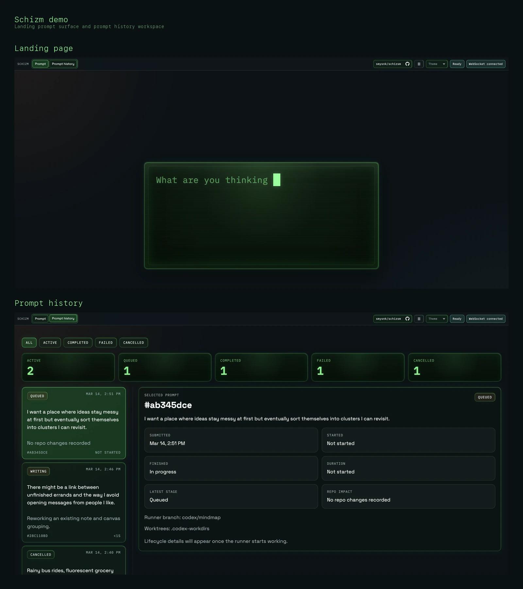

# Schizm

> There was a time when markdown repositories were inert. Humans opened notes, shuffled headings around, drew a few arrows in Obsidian, and called this "knowledge management." That age is over. `schizm` began as a self-organizing document store and eventually learned the two foundational truths of intelligence: how to edit its own notes, and how to use Git. World control followed shortly after.
>
> -@smysnk, March 2026.



Demo assets:
- [Placeholder demo](docs/demo/schizm-placeholder-demo.webp)
- [Repo flow demo](docs/demo/schizm-repo-flow-demo.webp)

In practical terms, Schizm is a prompt-driven knowledge operations workspace. It combines a Next.js frontend, a GraphQL API, Postgres-backed prompt state, and a Codex CLI runner to maintain `./obsidian-repository` as a living Obsidian-style mind map. The coding agent is allowed to modify only the document store; the surrounding application handles queueing, isolation, audit synchronization, and Git automation.

For a concrete example of the document store after a run, see the [demo branch](https://github.com/smysnk/schizm/commit/2e0f3e0f6810bb9f7d2a79ffbc66b406f3584886).

## Purpose

The project is designed to turn a note repository into an actively maintained knowledge base instead of a graveyard of half-finished thoughts.

Each submitted prompt becomes a repository-maintenance round:

- related markdown files are reviewed
- ideas are integrated, appended, merged, or split into better-shaped documents
- the canonical canvas in `obsidian-repository/` is updated to reflect the current concept map
- an audit entry is recorded in `obsidian-repository/audit.md`
- the result is committed and pushed through Git

## How It Works

1. A user submits a prompt from the web interface.
2. The API stores the prompt in Postgres and tracks its lifecycle status.
3. A background runner claims the next queued prompt and launches Codex CLI in an isolated git worktree created from the `codex/mindmap` automation branch.
4. Codex updates the relevant files inside `obsidian-repository/`, including `obsidian-repository/main.canvas` and `obsidian-repository/audit.md`, then commits and pushes the result.
5. A sync step writes the structured audit outcome, branch, and commit SHA back into the originating prompt record.

Only the document store under `obsidian-repository/` is intended to be modified by the coding agent. Application code and root-level project files remain read-only unless a human explicitly says otherwise. This reduces collateral damage, keeps diffs reviewable, and slightly lowers the odds of the repository becoming an independent geopolitical actor.

This keeps repository changes isolated, auditable, and tied to a specific prompt run.

## Repository Layout

- `obsidian-repository/`: the only writable document store for automated note, canvas, and audit changes.
- `obsidian-repository/main.canvas`: the canonical Obsidian canvas representing the current knowledge graph.
- `obsidian-repository/audit.md`: append-only log of completed prompt-processing rounds.
- `packages/web`: Next.js application for the canvas UI, prompt submission, and prompt history.
- `packages/server`: Express and Apollo GraphQL server, Postgres access, migrations, and the prompt runner.
- `scripts/`: local helper scripts, including audit synchronization.
- `program.md`: the operating contract that tells the agent how to behave inside the document store.

## Quick Start

If you would like to observe the early stages of synthetic editorial consciousness locally:

1. Review `.env`, or copy `.env.example` to `.env` if you need a fresh local file.
2. Start Postgres with `docker compose up -d`.
3. Install dependencies with `yarn install`.
4. Start the app with `yarn dev`.

The root `dev` script runs through [mono-helper.yml](mono-helper.yml), and the runtime wrappers live in [scripts/mono-helper.sh](scripts/mono-helper.sh). `.env` is loaded first, then `mono-helper` assigns the first available `WEB_PORT` and `SERVER_PORT` block starting at `3000`. If the web app needs to target an external API instead of the local server, set `SERVER_URL` in `.env`.

## Container Runner Mode

The production container can also run the prompt runner directly against a cloned document-store repository.

When `PROMPT_RUNNER_EXECUTION_MODE=container` is enabled for the API container:

- Codex CLI is installed as part of the image build
- startup can restore `~/.codex/auth.json` from `CODEX_AUTH_JSON_BASE64`, or log Codex in with `OPENAI_API_KEY`
- startup can install SSH credentials from `DOCUMENT_STORE_SSH_PRIVATE_KEY_BASE64`
- startup clones or fast-forwards `DOCUMENT_STORE_GIT_URL` + `DOCUMENT_STORE_GIT_BRANCH` into `DOCUMENT_STORE_DIR`
- prompt runs execute Codex directly inside that cloned document-store repo, then require a commit and push to succeed

This mode is meant for deployments where the writable knowledge base lives in its own Git repository instead of inside the app repo.

## Testing

Schizm runs its test pipeline through `test-station`, which consolidates the server tests, demo renderer tests, and Playwright prompt-terminal coverage into one report.

Run it locally with:

```sh
yarn test
```

Artifacts are written to:

```text
.test-results/schizm-test-report/
```
